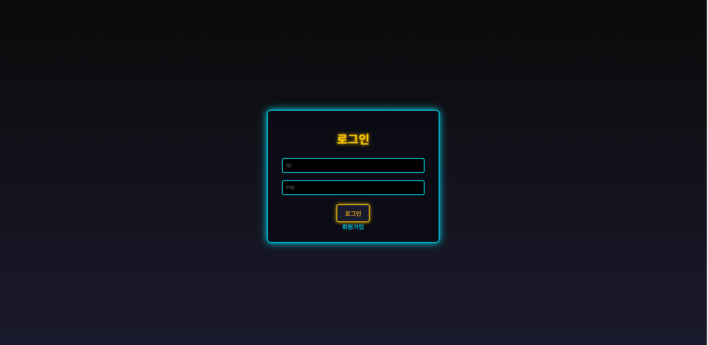
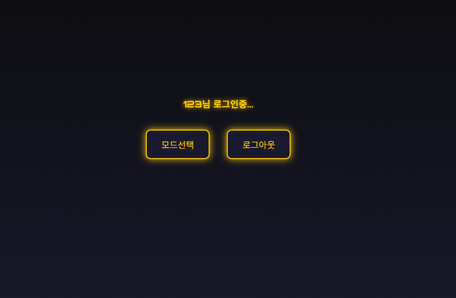
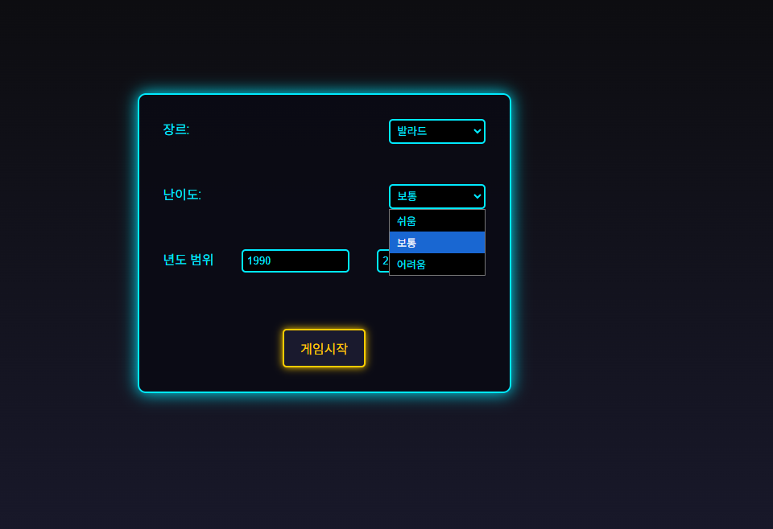
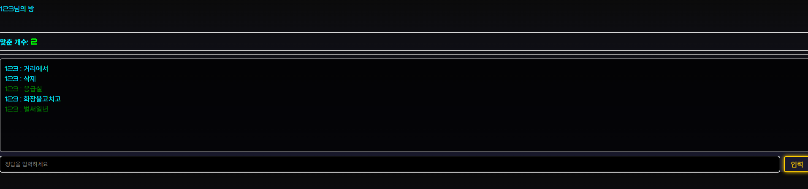

# 🎵 노래 제목 맞추기 게임 (Java 17 + Spring Boot + MySQL)
  
이 프로젝트는 **노래를 듣고 제목을 맞추는 게임**입니다.  
솔로 모드부터 시작해서, 추후 **웹소켓 기반 멀티 모드**까지 확장할 예정이에요.  

---

## 🛠 기술 스택

- **Backend:** Java 17, Spring Boot  
- **Database:** MySQL  
- **Frontend:** HTML + CSS + JS (Thymeleaf 사용)  
- **기타:** 유튜브 ID(`v=`)를 이용해 노래 저장, 웹소켓(WebSocket) 예정  

---

## 🎮 기능

### 1. 솔로 모드
- 유저가 장르, 난이도, 연도 범위를 선택하고 게임 시작
- 게임 화면에서 음악을 듣고 제목을 맞추는 플레이
- 정답 개수 표시, 정답 채팅 기록, 입력창 제공
- 게임 종료 시 최종 점수 출력  

### 2. 멀티 모드 (추후 구현 예정)
- 실시간 정답 경쟁
- 채팅창 연동
- 점수 순위 표시  

---

## 🎵 데이터 저장 방식
- 각 음악은 **유튜브 ID**로 DB에 저장  
  예: `1-Lm2LUR8Ss`
- Music 테이블과 연결해 게임에서 불러옴  

---

## 🖼 화면 구성

| 화면 | 설명 | 이미지 |
|------|------|------|
| **메인 화면** | 게임 시작 화면 |  |
| **모드 선택 화면** | 솔로 / 멀티 선택 |  |
| **게임 세팅 화면** | 장르, 난이도, 연도 범위 설정 |  |
| **플레이 화면** | 실제 게임 진행 화면 |  |

---

